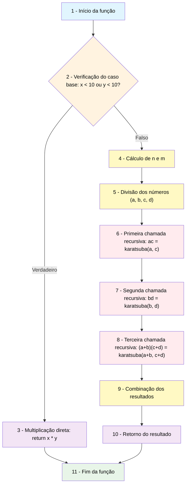

# Projeto - Algoritmo de Karatsuba

## Descrição do Projeto

O **Algoritmo de Karatsuba** é uma técnica eficiente para multiplicação de números inteiros grandes, introduzida por Anatolii Karatsuba em 1960. Este projeto implementa o algoritmo em Python, demonstrando a estratégia "dividir para conquistar" para melhorar a eficiência da multiplicação.

### Lógica do Algoritmo Implementado

O algoritmo utiliza a estratégia "dividir para conquistar" seguindo a seguinte lógica linha a linha:

```python
def karatsuba(x, y):
    # Linha 1-2: Caso base - números pequenos usam multiplicação direta
    if x < 10 or y < 10:
        return x * y
    
    # Linha 3-4: Calcula o número de dígitos e define o ponto de divisão
    n = max(len(str(x)), len(str(y)))
    m = n // 2
    
    # Linha 5-10: Divide os números em duas partes (high e low)
    divisor = 10 ** m
    a = x // divisor  # Parte alta de x
    b = x % divisor   # Parte baixa de x
    c = y // divisor  # Parte alta de y
    d = y % divisor   # Parte baixa de y
    
    # Linha 11-13: Três multiplicações recursivas (chave do algoritmo)
    z2 = karatsuba(a, c)           # ac (partes altas)
    z0 = karatsuba(b, d)           # bd (partes baixas)
    z1 = karatsuba(a + b, c + d)   # (a+b)(c+d) (somas cruzadas)
    
    # Linha 14: Aplica a fórmula de Karatsuba
    return z2 * (10 ** (2 * m)) + (z1 - z2 - z0) * (10 ** m) + z0
```

**Explicação da Fórmula:**
- Para x = a×10^m + b e y = c×10^m + d
- xy = ac×10^(2m) + ((a+b)(c+d) - ac - bd)×10^m + bd
- Reduz 4 multiplicações tradicionais para apenas 3 multiplicações recursivas

## Como Executar o Projeto

### Pré-requisitos
- Python 3.6 ou superior
- Nenhuma biblioteca externa necessária

### Passos para Execução

1. **Clone o repositório:**
```bash
git clone https://github.com/arthurcuri/karatsuba.git
cd karatsuba
```

2. **Execute o programa principal:**
```bash
python main.py
```

3. **Saída esperada:**
```
Algoritmo de Karatsuba - Multiplicação Eficiente
==================================================
MELHOR CASO:
7 × 8 = 56
------------------------------
CASO MÉDIO:
1234 × 5678 = 7006652
------------------------------
PIOR CASO:
12345678901234567890123456789012345678901234567890 × 98765432109876543210987654321098765432109876543210 = 1219326311370217952237463801111263526900950546819938110687710746251112635228880628507631677170177736637895133106030830628507631677026363299465240810185508013617840010000000000000000000000000000
------------------------------
```

### 1. Análise da Complexidade Ciclomática

#### Representação do Fluxo de Controle

O algoritmo de Karatsuba possui a seguinte estrutura de controle:



#### Estrutura do Grafo de Fluxo

**Nós do Grafo:**
1. Início da função
2. Verificação do caso base (`if x < 10 or y < 10`)
3. Multiplicação direta (`return x * y`)
4. Cálculo de n e m
5. Divisão dos números (a, b, c, d)
6. Primeira chamada recursiva (`z2 = karatsuba(a, c)`)
7. Segunda chamada recursiva (`z0 = karatsuba(b, d)`)
8. Terceira chamada recursiva (`z1 = karatsuba(a + b, c + d)`)
9. Combinação dos resultados
10. Retorno do resultado
11. Fim da função

**Número total de nós: N = 11**

**Arestas do Grafo:**
* (1→2): Entrada na função
* (2→3): Caso base verdadeiro
* (2→4): Caso base falso
* (3→11): Retorno direto
* (4→5): Sequencial
* (5→6): Sequencial
* (6→7): Sequencial
* (7→8): Sequencial
* (8→9): Sequencial
* (9→10): Sequencial
* (10→11): Retorno

**Número total de arestas: E = 11**

**Componentes conexos (P):** A função é uma unidade única, então **P = 1**

#### Cálculo da Complexidade Ciclomática

Usando a fórmula: **M = E - N + 2P**

Onde:
- E = 11 (número de arestas)
- N = 11 (número de nós)
- P = 1 (número de componentes conexos)

**M = 11 - 11 + 2(1) = 2**

**Resultado: Complexidade Ciclomática = 2**

Esta baixa complexidade ciclomática indica que o algoritmo possui um fluxo de controle simples, com apenas uma decisão condicional (if do caso base).

### 2. Análise da Complexidade Assintótica

#### Complexidade Temporal

**Análise da Recorrência:**

A função de recorrência do algoritmo de Karatsuba é:
- T(n) = 3T(n/2) + O(n)

Onde:
- 3 representa as três chamadas recursivas
- n/2 é o tamanho reduzido do problema
- O(n) é o tempo para dividir e combinar

**Aplicando o Teorema Mestre:**
- a = 3 (número de subproblemas)
- b = 2 (fator de redução)
- f(n) = n (tempo de divisão/combinação)

Como 3 > 2¹, temos:
**T(n) = O(n^(log₂3)) = O(n^1.585)**

#### Análise por Casos

**1. Melhor Caso: O(n^1.585)**
- Ocorre independentemente dos valores de entrada
- O algoritmo sempre realiza o mesmo número de operações para números de mesmo tamanho

**2. Caso Médio: O(n^1.585)**
- Comportamento consistente devido à natureza determinística do algoritmo
- Não há variação significativa baseada nos valores dos dígitos

**3. Pior Caso: O(n^1.585)**
- Mantém a mesma complexidade mesmo no pior cenário
- Muito superior ao O(n²) da multiplicação tradicional

#### Complexidade Espacial

**Análise do Espaço:**

A complexidade espacial é determinada pela:
1. **Pilha de recursão:** O(log n) níveis de profundidade
2. **Variáveis temporárias:** O(n) espaço por chamada
3. **Espaço total:** O(n log n)

**Detalhamento:**
- Cada chamada recursiva cria variáveis locais (a, b, c, d, z0, z1, z2)
- A profundidade da recursão é log₂n
- Espaço por nível: O(n)
- **Complexidade Espacial Total: O(n log n)**

#### Comparação com Multiplicação Tradicional

| Aspecto | Tradicional | Karatsuba |
|---------|------------|-----------|
| **Complexidade Temporal** | O(n²) | O(n^1.585) |
| **Complexidade Espacial** | O(1) | O(n log n) |
| **Eficiência para números grandes** | Baixa | Alta |

## Autor

- **Nome**: Arthur Curi
- **Repositório**: https://github.com/arthurcuri/karatsuba
- **Disciplina**: Fundamentos de Projeto e Análise de Algoritmos
- **Data**: Agosto de 2025
